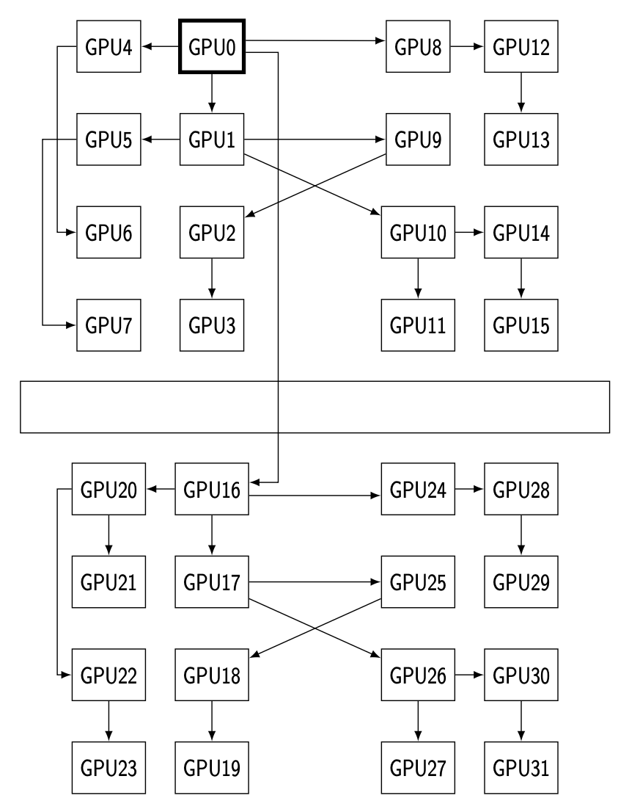
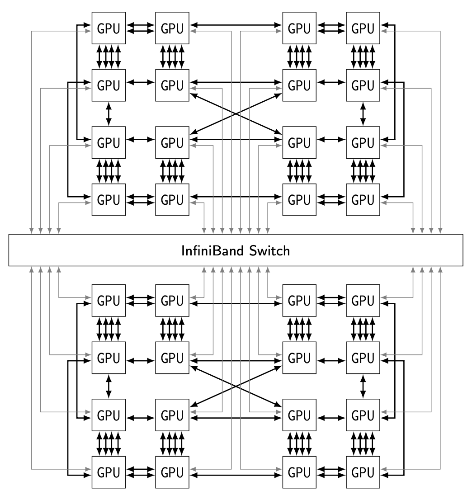

# ForestColl

Paper: [ForestColl: Efficient Collective Communications on Heterogeneous Network Fabrics](https://arxiv.org/abs/2402.06787)

## Compute Algorithmic Bandwidth

```python
from pipeline_allgather import OptimalBranchingsAlgo
from topologies import a100_topology

G, gpus = a100_topology(2)  # 2x8 A100
algo = OptimalBranchingsAlgo(G, capacitated=True, compute_nodes=gpus)
U, k = algo.binary_search()
opt_algbw = 1 / algo.convertToRuntime(U, k)
print(f"optimal algbw: {opt_algbw:.2f} GB/s")
```

## Generate Trees

```python
from pipeline_allgather import optimal_pipeline_spanning_trees, spanning_trees_to_xml
from topologies import mi250_topology

G, gpus = mi250_topology(2)  # 2x16 MI250
(U, k), (Ts, Cs) = optimal_pipeline_spanning_trees(G, compute_nodes=gpus)
# (U, k), (Ts, Cs) = optimal_pipeline_spanning_trees(G, compute_nodes=gpus, fixed_K=1)  # fixed k
algbw = len(gpus) * k / U
print(f"U={U}, k={k}")
print(f"{algbw} GBps")

tree_xml = spanning_trees_to_xml(Ts, Cs, k)
print(tree_xml)
```
For example, the tree rooted at GPU 0 at node 0 is:
```xml
<tree root="(0, 'GPU', 0)" index="0" nchunks="1" height="5">
    <send src="(0, 'GPU', 0)" dst="(0, 'GPU', 1)" path="(0, 'GPU', 0),(0, 'GPU', 1)"/>
    <send src="(0, 'GPU', 0)" dst="(0, 'GPU', 4)" path="(0, 'GPU', 0),(0, 'GPU', 4)"/>
    <send src="(0, 'GPU', 0)" dst="(0, 'GPU', 8)" path="(0, 'GPU', 0),(0, 'GPU', 8)"/>
    <send src="(0, 'GPU', 0)" dst="(1, 'GPU', 0)" path="(0, 'GPU', 0),(-1, 'IB', 0),(1, 'GPU', 0)"/>
    <send src="(0, 'GPU', 1)" dst="(0, 'GPU', 5)" path="(0, 'GPU', 1),(0, 'GPU', 5)"/>
    <send src="(0, 'GPU', 1)" dst="(0, 'GPU', 9)" path="(0, 'GPU', 1),(0, 'GPU', 9)"/>
    <send src="(0, 'GPU', 1)" dst="(0, 'GPU', 10)" path="(0, 'GPU', 1),(0, 'GPU', 10)"/>
    <send src="(0, 'GPU', 4)" dst="(0, 'GPU', 6)" path="(0, 'GPU', 4),(0, 'GPU', 6)"/>
    <send src="(0, 'GPU', 8)" dst="(0, 'GPU', 12)" path="(0, 'GPU', 8),(0, 'GPU', 12)"/>
    <send src="(1, 'GPU', 0)" dst="(1, 'GPU', 1)" path="(1, 'GPU', 0),(1, 'GPU', 1)"/>
    <send src="(1, 'GPU', 0)" dst="(1, 'GPU', 4)" path="(1, 'GPU', 0),(1, 'GPU', 4)"/>
    <send src="(1, 'GPU', 0)" dst="(1, 'GPU', 8)" path="(1, 'GPU', 0),(1, 'GPU', 8)"/>
    <send src="(0, 'GPU', 5)" dst="(0, 'GPU', 7)" path="(0, 'GPU', 5),(0, 'GPU', 7)"/>
    <send src="(0, 'GPU', 9)" dst="(0, 'GPU', 2)" path="(0, 'GPU', 9),(0, 'GPU', 2)"/>
    <send src="(0, 'GPU', 10)" dst="(0, 'GPU', 11)" path="(0, 'GPU', 10),(0, 'GPU', 11)"/>
    <send src="(0, 'GPU', 10)" dst="(0, 'GPU', 14)" path="(0, 'GPU', 10),(0, 'GPU', 14)"/>
    <send src="(0, 'GPU', 12)" dst="(0, 'GPU', 13)" path="(0, 'GPU', 12),(0, 'GPU', 13)"/>
    <send src="(1, 'GPU', 1)" dst="(1, 'GPU', 9)" path="(1, 'GPU', 1),(1, 'GPU', 9)"/>
    <send src="(1, 'GPU', 1)" dst="(1, 'GPU', 10)" path="(1, 'GPU', 1),(1, 'GPU', 10)"/>
    <send src="(1, 'GPU', 4)" dst="(1, 'GPU', 5)" path="(1, 'GPU', 4),(1, 'GPU', 5)"/>
    <send src="(1, 'GPU', 4)" dst="(1, 'GPU', 6)" path="(1, 'GPU', 4),(1, 'GPU', 6)"/>
    <send src="(1, 'GPU', 8)" dst="(1, 'GPU', 12)" path="(1, 'GPU', 8),(1, 'GPU', 12)"/>
    <send src="(0, 'GPU', 2)" dst="(0, 'GPU', 3)" path="(0, 'GPU', 2),(0, 'GPU', 3)"/>
    <send src="(0, 'GPU', 14)" dst="(0, 'GPU', 15)" path="(0, 'GPU', 14),(0, 'GPU', 15)"/>
    <send src="(1, 'GPU', 9)" dst="(1, 'GPU', 2)" path="(1, 'GPU', 9),(1, 'GPU', 2)"/>
    <send src="(1, 'GPU', 10)" dst="(1, 'GPU', 11)" path="(1, 'GPU', 10),(1, 'GPU', 11)"/>
    <send src="(1, 'GPU', 10)" dst="(1, 'GPU', 14)" path="(1, 'GPU', 10),(1, 'GPU', 14)"/>
    <send src="(1, 'GPU', 6)" dst="(1, 'GPU', 7)" path="(1, 'GPU', 6),(1, 'GPU', 7)"/>
    <send src="(1, 'GPU', 12)" dst="(1, 'GPU', 13)" path="(1, 'GPU', 12),(1, 'GPU', 13)"/>
    <send src="(1, 'GPU', 2)" dst="(1, 'GPU', 3)" path="(1, 'GPU', 2),(1, 'GPU', 3)"/>
    <send src="(1, 'GPU', 14)" dst="(1, 'GPU', 15)" path="(1, 'GPU', 14),(1, 'GPU', 15)"/>
</tree>
```
which corresponds to the following tree:



Original topology:



## To MSCCL/RCCL XML

```python
from pipeline_allgather import optimal_pipeline_spanning_trees
from topologies import a100_topology
from to_xml import construct_algo_allreduce
import xml.etree.ElementTree as ET
from xml.dom import minidom

G, gpus = a100_topology(2)  # 2x8 A100
(U, k), (Ts, Cs) = optimal_pipeline_spanning_trees(G, compute_nodes=gpus, fixed_K=1)

# reindex gpus and handle odd/even channels for IB nics
gpu_index = lambda n: n[0] * 8 + n[2]
nTs = {}
for (u, i), ps in Ts.items():
    nps = []
    nTs[gpu_index(u), i] = nps
    for p in ps:
        ns = set([n for n, _ in p] + [n for _, n in p])
        assert not ((-1, "IB", 0) in ns and (-1, "IB", 1) in ns)
        odd_even = None
        if (-1, "IB", 0) in ns:
            odd_even = 0
        elif (-1, "IB", 1) in ns:
            odd_even = 1
        nps.append([(gpu_index(p[0][0]), gpu_index(p[-1][-1]), odd_even)])
nCs = {(gpu_index(u), i): c for (u, i), c in Cs.items()}
nodes = sorted(map(gpu_index, gpus))

algo = construct_algo_allreduce(nTs, nCs, k, nodes, ninstance=1)
s = ET.tostring(algo, 'utf-8')
s = minidom.parseString(s)
s = s.toprettyxml(indent="  ")
s = '\n'.join(s.split('\n')[1:])
print(s)
```